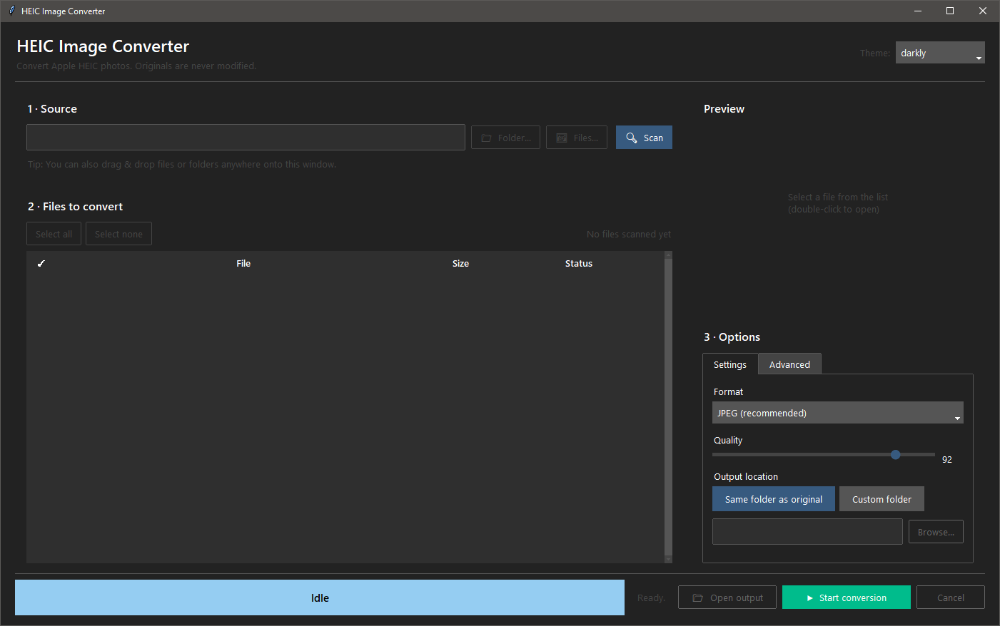

# HEIC Image Converter

Cross-platform (Windows + Linux) GUI + CLI tool to convert Apple HEIC/HEIF images
to JPEG, PNG, or WebP.

> **Originals are never modified, moved, or deleted.** The tool only reads them.



## Features

### Core
- Recursively scan folders (or pick individual files) for `.heic` / `.heif`
- Per-file selection (click the ✓ column, press Space, or use Select all/none)
- Drag & drop folders/files onto the window
- Live thumbnail preview of the selected file
- Output formats: **JPEG** (default), **PNG**, **WebP** with a **quality slider**
- **Two output modes**:
  - **Same folder as the original** — converted file written next to the source, mirroring the tree
  - **Custom folder** — write into a separate folder you choose; source structure mirrored under it
- Live progress bar with running counts (ok / skipped / failed), elapsed time, and **ETA**
- Cancel mid-run; parallel workers
- Modern dark theme

### Smart conversion
- **Preserves EXIF + ICC color profile** by default
- **Auto-rotate** using EXIF orientation, then strips the orientation tag so every viewer shows it correctly
- **Organize by capture date** — optionally place outputs in `YYYY/YYYY-MM-DD/` subfolders read from EXIF
- **Conflict policy** — *skip* / *overwrite* / *rename with suffix*
- **Verify pass** — re-opens every output to confirm it decodes and matches expected dimensions
- **Hash cache** — SHA-256 of every source remembered in a sidecar `.heic-converter-cache.json`, so re-runs on a huge library skip already-converted files instantly
- **Dry-run mode** — see exactly what would happen without writing anything
- **Run log** — `conversion-log.txt` written into the output root for auditability

### CLI
- Same engine used from the GUI is exposed as `cli.py` for scripting / cron

## Install

Requires Python 3.10+. The project is managed with [uv](https://docs.astral.sh/uv/).

If you don't have uv yet:

```powershell
# Windows (PowerShell)
winget install --id=astral-sh.uv -e
# or:  irm https://astral.sh/uv/install.ps1 | iex
```

```bash
# Linux / macOS
curl -LsSf https://astral.sh/uv/install.sh | sh
```

Then, from the project folder:

```powershell
# Creates .venv and installs all runtime dependencies
uv sync
```

> On some Linux distros Tk is shipped separately, e.g. `sudo apt install python3-tk`.

## Run the GUI

```powershell
uv run python app.py
# or, after `uv sync`, via the registered script:
uv run heic-converter-gui
```

### Workflow

1. **Source** — pick a folder to scan, drop one onto the window, or pick individual files. Click *Scan*.
2. **Select** — tick/untick files in the list; the right pane shows a thumbnail preview.
3. **Options**
   - **Output format / quality** — JPEG quality 92 is a great default
   - **Output location** — *Same folder as original* OR *Custom folder*
   - **If output exists** — *skip* / *overwrite* / *rename*
   - Toggles: Preserve EXIF, Auto-rotate, Organize by capture date, Verify, Hash cache, Dry run, Write log
   - **Parallel workers** — 4 is a good default; raise on fast SSDs with many cores
4. **Start** — watch progress, ok/skip/err counts, and ETA. Cancel anytime.

## Run the CLI

```powershell
# Convert into a custom folder
uv run heic-converter "C:\Photos" --output "C:\Converted" --format jpeg --quality 90

# In-place (write JPEGs next to each HEIC; originals untouched)
uv run heic-converter "C:\Photos" --in-place --organize-by-date

# Multi-input dry run with renaming on conflicts
uv run heic-converter img1.HEIC img2.HEIC --output out --on-conflict rename --dry-run

uv run heic-converter --help
```

You can also call the module directly: `uv run python cli.py …`.

## Project layout

- [app.py](app.py) — Tkinter GUI (drag-and-drop, dark theme, preview)
- [converter.py](converter.py) — Pure conversion engine (no Tk dependency)
- [cli.py](cli.py) — Command-line interface using the same engine
- [pyproject.toml](pyproject.toml) — uv / PEP 621 project metadata + dependencies

## Notes & caveats

- The hash cache and the run log are written into the output root
  (`<output_dir>` for custom folder mode, the source root for in-place mode).
  Delete `.heic-converter-cache.json` to force re-conversion of everything.
- "Organize by capture date" requires EXIF `DateTimeOriginal`; files without it
  fall back to the mirrored source layout.
- Hardware-accelerated HEIC decoding is provided automatically by `pillow-heif`
  (which links `libheif` + `libde265`); no extra setup needed on Windows or Linux.

## Troubleshooting

- **Tkinter errors on Linux**: Make sure you have `python3-tk` installed (`sudo apt install python3-tk`).
- **Drag & drop not working**: Ensure you are running the app with a supported Python version and have all dependencies installed. On Linux, some desktop environments may not support TkinterDnD2.
- **Missing GUI elements or crashes**: Try updating all dependencies with `uv pip install --system --upgrade .`.
- **Permission errors**: Make sure you have write access to the output directory.

## Contributing

Contributions are welcome! Please open issues or pull requests. See the [CONTRIBUTING.md](CONTRIBUTING.md) for guidelines (or create one if you want to accept contributions).

